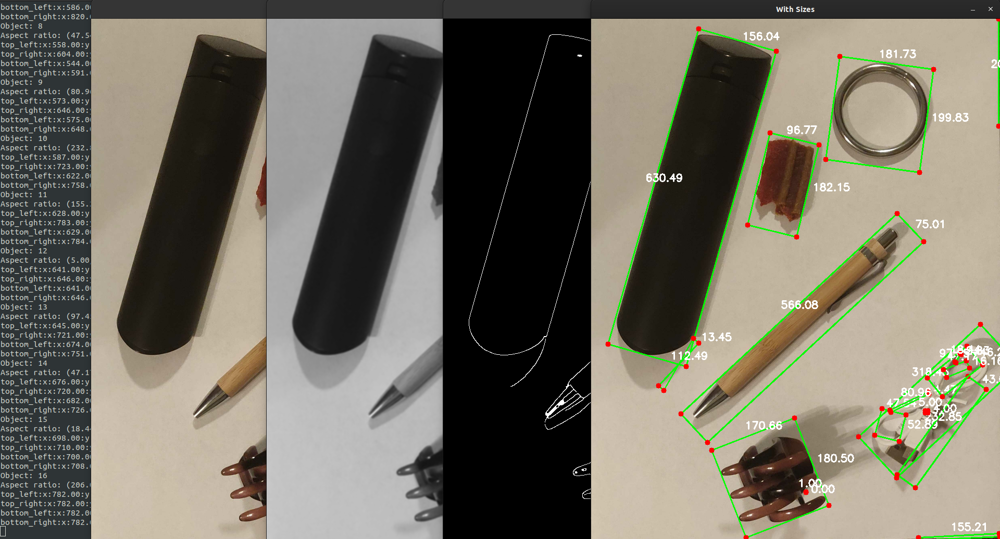
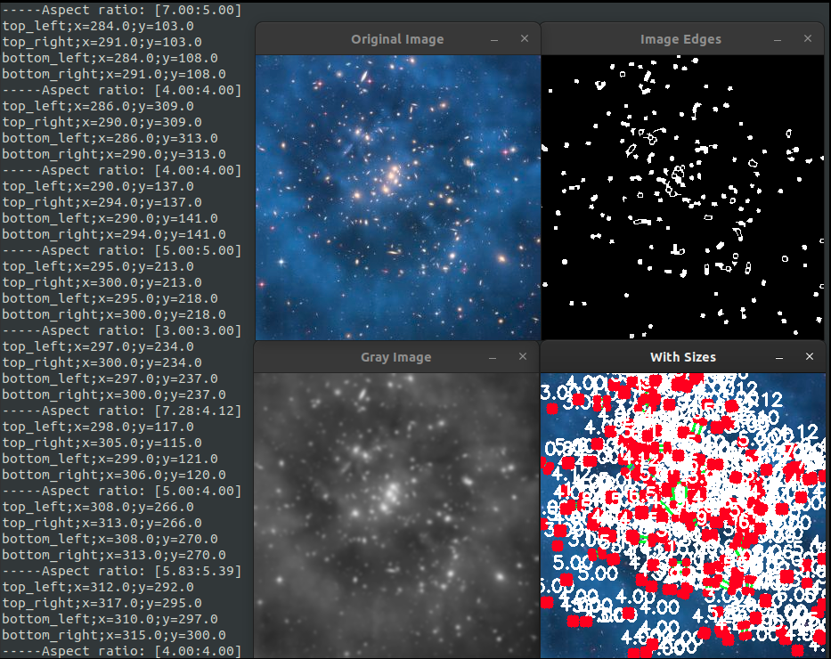
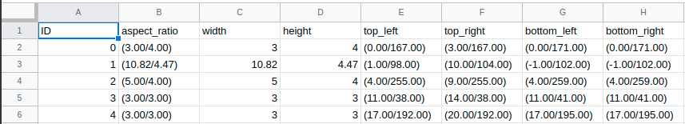

# AspectRatio
[](https://opensource.org/licenses/Apache-2.0)
[](https://www.gnu.org/software/bash/)
[](https://www.python.org/)
[](https://en.wikipedia.org/wiki/0)



Find objects in an image and get their aspect ratio.

## Install Dependencies:
```
$ bash requirements.sh
```
**Note:** This install scripts only works with debian based distro, but the only 3 requirements are python3-opencv, scipy, and imutils.
This code should runs on any platforms.

## Example Run:
```
$ python3 aspect_ratio.py --image test_data/stars.jpg --show_images True --out_file output.csv
Object: 0
Aspect ratio: (630.49/156.04)
Object: 1
Aspect ratio: (112.49/13.45)
Object: 2
.....
```

The above run will write all the results to a csv file that looks like this:

```
$ cat output.csv 
ID,aspect_ratio,width,height,top_left,top_right,bottom_left,bottom_right
0,(3.00/4.00),3.00,4.00,(0.00/167.00),(3.00/167.00),(0.00/171.00),(0.00/171.00)
1,(10.82/4.47),10.82,4.47,(1.00/98.00),(10.00/104.00),(-1.00/102.00),(-1.00/102.00)
2,(5.00/4.00),5.00,4.00,(4.00/255.00),(9.00/255.00),(4.00/259.00),(4.00/259.00)
```

Which will looks like this if open with Google Sheets:


**Options:**
```
usage: aspect_ratio.py [-h] --image IMAGE [--show_images SHOW_IMAGES]
                       [--show_final SHOW_FINAL]
                       [--show_each_objects SHOW_EACH_OBJECTS]
                       [--print_boxes PRINT_BOXES] [--out_file OUT_FILE]

optional arguments:
  -h, --help            show this help message and exit
  --image IMAGE         Path to image.
  --show_images SHOW_IMAGES
                        Show images from each steps.
  --show_final SHOW_FINAL
                        Show final image.
  --show_each_objects SHOW_EACH_OBJECTS
                        Show each object after drawing boxes.
  --print_boxes PRINT_BOXES
                        Print Boxes.
  --out_file OUT_FILE   Output files.
```

## Credit:
Special thanks to PyImageSearch for teaching me how to extract contour from an image in [this amazing article](https://www.pyimagesearch.com/2016/03/28/measuring-size-of-objects-in-an-image-with-opencv/).
